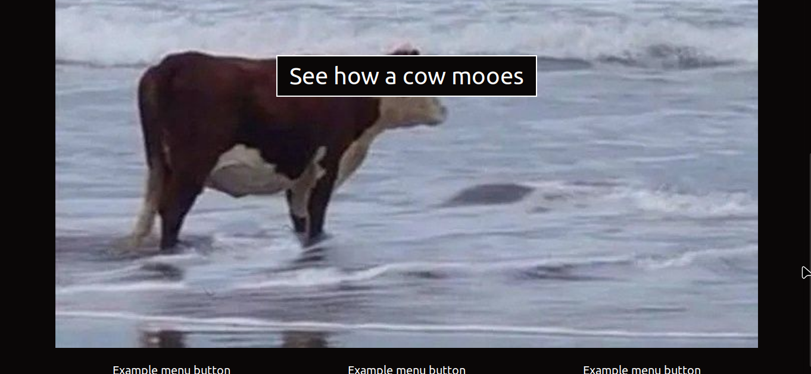

# AWS S3 bucket Static Website Example 🪣
**🤖 This repository contains an example of a static one-page site that you can deploy to your AWS S3 Bucket as you explore this S3 service.**

>This repository contains an example site that can be hosted on AWS S3 to practice working with this service. For details on exactly how to work with S3, see the official AWS documentation on the subject:

* **[🔴Tutorial: Configuring a static website on Amazon S3🪣](https://docs.aws.amazon.com/AmazonS3/latest/userguide/HostingWebsiteOnS3Setup.html)**
* **[🔴Hosting a static website using Amazon S3🪣](https://docs.aws.amazon.com/AmazonS3/latest/userguide/WebsiteHosting.htm)**

  **or  Github tutorials:**

* **[🔴How to host Static Website on Amazon S3](https://github.com/sami-dev/aws-s3-static-website-sample)**

> **Project site screen:**

❗To run the site locally, clone the repository and open the **index.html** file.

**The main code of the site is located in the index.html file.**

>❗❗❗The site is not adapted for viewing on mobile devices❗❗❗.

* **[🔴This Project  WIKI PAGE](wiki.md)**

>🏆🌟If you have successfully launched a website on an S3 bucket, clicked on the button in the center and the cow in the video started screaming🐄, congratulations, you have successfully launched a website on an S3 bucket and purchased a new skill!

 **Good luck everyone learning S3 AWS!😎**

